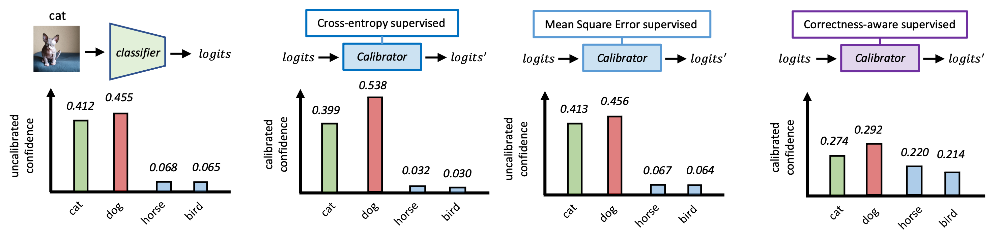

# Correctness-aware Calibration

 [Yuchi Liu](https://liuyvchi.github.io/), [Lei Wang](https://leiwangr.github.io/), [Yuli Zou](https://scholar.google.com/citations?user=QPUPu2gAAAAJ&hl=zh-CN), [James Zou](https://www.james-zou.com/), [Liang Zheng](https://zheng-lab.cecs.anu.edu.au)

<a href="https://arxiv.org/pdf/2404.13016"></a>
[](https://opensource.org/licenses/MIT)

This repository contains the source code for the paper "Optimizing Calibration by Gaining Aware of Prediction Correctness." 




## Abstract
Model calibration aims to align confidence with prediction correctness. The Cross-Entropy (CE) loss is widely used for calibrator training, which enforces the model to increase confidence on the ground truth class. However, we find the CE loss has intrinsic limitations. For example, for a narrow misclassification, a calibrator trained by the CE loss often produces high confidence on the wrongly predicted class (e.g., a test sample is wrongly classified and its softmax score on the ground truth class is around 0.4), which is undesirable. In this paper, we propose a new post-hoc calibration objective derived from the aim of calibration. Intuitively, the proposed objective function asks that the calibrator decrease model confidence on wrongly predicted samples and increase confidence on correctly predicted samples. Because a sample itself has insufficient ability to indicate correctness, we use its transformed versions (e.g., rotated, greyscaled and color-jittered) during calibrator training. Trained on an in-distribution validation set and tested with isolated, individual test samples, our method achieves competitive calibration performance on both in-distribution and out-of-distribution test sets compared with the state of the art. Further, our analysis points out the difference between our method and commonly used objectives such as CE loss and mean square error loss, where the latters sometimes deviates from the calibration aim.

## Prerequisites

Before you can run the scripts, you need to have Python installed along with the following packages:
- PyTorch
- torchvision

You can install these packages using pip:

```bash
pip install torch torchvision
```

## Data Preparation

To use the provided models and scripts, you will need to prepare your data according to the following directory structure:

```
├── data
│   ├── ImageNet-Val
│   ├── ImageNet-A
│   ├── ImageNet-R
│   ├── ImageNet-S
│   └── ObjectNet
└── modelOutput
    ├── imagenet_a_out_colorjitter
    │   ├── tv_reesnet152.npy
    │   └── ... 
    ├── imagenet_a_out_grey
    ├── imagenet_a_out_colorjitter
    └── ...
|── ckpt
└── src
```

### Directory Structure Details

- **data/**: This directory should contain all the datasets used for model calibration and testing.
- **modelOutput/**: This directory should be used to store model predictions (prediction logits). Different subdirectories within `modelOutput` can be used for different experimental configurations.
- **ckpt/**: Saaves trained calibrators.
- **src/**: Contains all the source code.

## Configuration

If you wish to run the scripts on your own data, you should modify the `option.py` file to update your configuration settings according to your local environment and data paths.

## How to Run

To start the calibration process, simply run the following command from the terminal:

```bash
python run_cal.py
```

## Citation
If you find our code helpful, please consider citing our paper:

```bibtex
@misc{liu2024optimizing,
      title={Optimizing Calibration by Gaining Aware of Prediction Correctness}, 
      author={Yuchi Liu and Lei Wang and Yuli Zou and James Zou and Liang Zheng},
      year={2024},
      eprint={2404.13016},
      archivePrefix={arXiv},
      primaryClass={cs.CV}
}
```

## License

This project is open source and available under the [MIT License](LICENSE.md).

